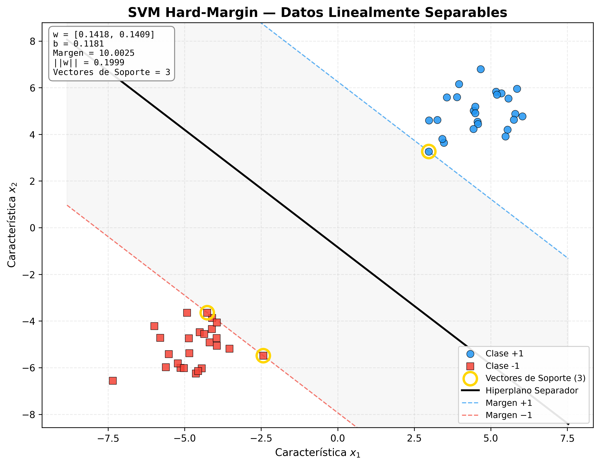
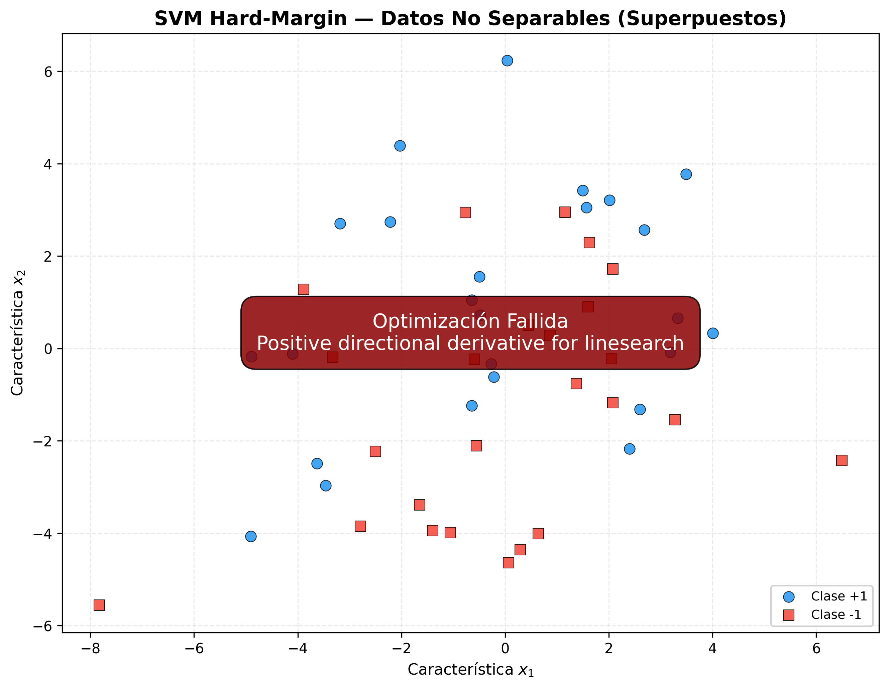
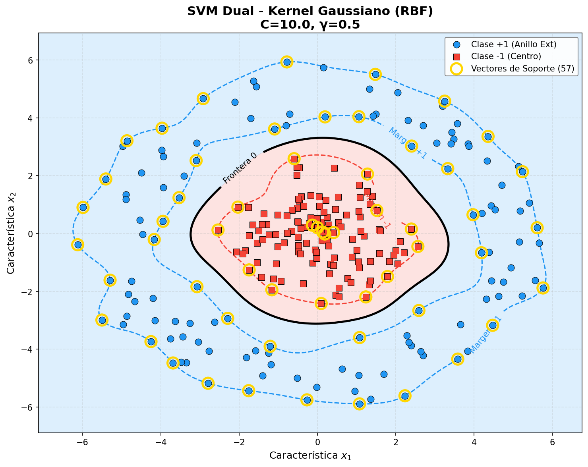
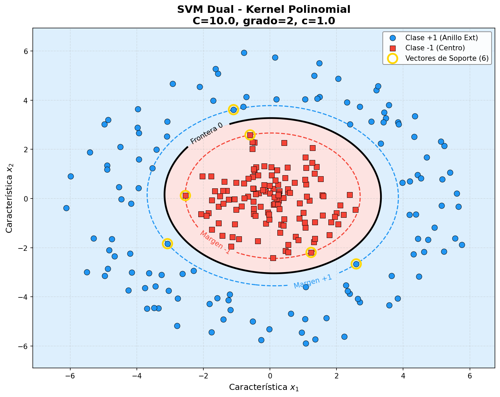
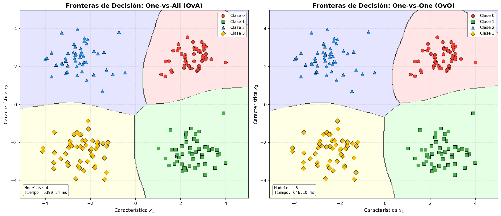

# Máquinas de Vectores de Soporte (SVM) — Informe de Resultados

Implementación desde cero de cuatro variaciones del algoritmo SVM, desarrolladas en Python con `numpy`, `scipy` y `matplotlib`. Cada sección corresponde a una asignación del proyecto y presenta los resultados visuales generados por los scripts.

---

## 1. Modelo Lineal Estricto (Hard Margin SVM)

**Script:** `hard_margin/main.py`

Resuelve el problema primal $\min_{w,b} \frac{1}{2}\|w\|^2$ sujeto a $y_i(w^\top x_i + b) \geq 1$, encontrando el hiperplano de margen máximo para datos linealmente separables en 2D. Al aplicarse sobre datos superpuestos, el solver falla, demostrando la limitación del modelo.

### Resultados





### Observaciones

- En datos separables, el solver converge exitosamente identificando **3 vectores de soporte** con un margen geométrico de ~10.00. El hiperplano y las bandas de margen $\pm1$ encapsulan correctamente los puntos más cercanos de cada clase.
- En datos superpuestos, el solver reporta **"Optimización Fallida"** (*Positive directional derivative for linesearch*), confirmando que las restricciones rígidas $y_i(w^\top x_i + b) \geq 1$ son incompatibles cuando las clases se intersectan. Esto justifica la necesidad del Soft Margin.

---

## 2. Identificador de Separabilidad (Soft Margin SVM)

**Script:** `soft_margin/main.py`

Incorpora variables de holgura ($\xi_i$) y el hiperparámetro de penalización $C$ mediante la formulación dual, permitiendo tolerar errores dentro del margen. Se evalúan cuatro kernels (Gaussiano, Polinomial, Lineal y Sigmoide) sobre datasets no lineales (`moons`, `circles`) para diagnosticar la separabilidad en el espacio de características inducido.

### Resultados

.png)

.png)

.png)

.png)

### Observaciones

- El **kernel Gaussiano** ($\gamma=2.0$, $C=5.0$) logra una frontera curva que separa las medias lunas con solo **13 vectores de soporte** y apenas 3 violaciones de margen ($\xi > 0$), demostrando alta separabilidad en el espacio inducido por $\phi$.
- El **kernel Lineal** fracasa visiblemente: genera **52 vectores de soporte** y **49 violaciones**, ya que fuerza un hiperplano recto sobre datos intrínsecamente no lineales. La gran cantidad de $\xi_i > 0$ confirma que los datos no son separables en el espacio original $\mathbb{R}^2$.
- Los kernels **Polinomial** y **Sigmoide** ofrecen resultados intermedios, mostrando cómo la elección del kernel y sus hiperparámetros determina la calidad de la frontera de decisión.

---

## 3. Clasificador No Lineal (Problema Dual + Kernel Trick)

**Script:** `dual_kernel/main.py`

Aplica la formulación dual con kernel Gaussiano (RBF) y Polinomial sobre datos distribuidos en anillos concéntricos, donde no existe hiperplano lineal posible. La función de decisión se construye enteramente en el espacio de características implícito $\phi(x)$ mediante la matriz de Gram.

### Resultados





### Observaciones

- El **kernel RBF** ($C=5.0$, $\gamma=1.0$) genera una frontera de decisión cerrada que envuelve el clúster central, separando correctamente la distribución concéntrica de anillos. Se identifican **88 vectores de soporte**, consistente con la complejidad circular de la frontera.
- El **kernel Polinomial** (grado 2) produce una frontera menos ajustada. Al operar con una transformación de menor dimensionalidad que el RBF, no captura con la misma fidelidad la geometría radial de los datos.

---

## 4. Multiclasificación (4 clases)

**Script:** `multiclass_classifier/main.py`

Extiende el clasificador binario a 4 clases comparando dos estrategias de descomposición: **One-vs-All** (OvA), que entrena $N$ clasificadores, y **One-vs-One** (OvO), que entrena $\frac{N(N-1)}{2}$ clasificadores. OvO opera sobre subconjuntos más pequeños, lo que generalmente resulta en menor tiempo total de entrenamiento.

### Resultados



### Comparativa de Estrategias

| Estrategia | Cantidad de Clasificadores | Tiempo de Ejecución Total |
|:----------:|:--------------------------:|:-------------------------:|
| One-vs-All (OvA) | 4 | ~5390 ms |
| One-vs-One (OvO) | 6 | ~646 ms |

### Observaciones

- Aunque OvO entrena **más clasificadores** (6 vs 4), cada uno opera sobre subconjuntos de ~100 muestras en lugar de las 200 completas. Dado que la complejidad del solver SLSQP crece supralinealmente con $n$, OvO resulta **~8.3x más rápido** en tiempo total de entrenamiento.
- Visualmente, ambas estrategias producen fronteras de decisión similares para las 4 clases, pero las regiones de OvO presentan transiciones ligeramente más definidas al resolver cada par de clases de forma aislada.

---

## Apéndice: Requisitos y Ejecución

### Configuración del Entorno

```bash
# 1. Crear el entorno virtual
python -m venv .venv

# 2. Activar el entorno virtual
# Windows:
.venv\Scripts\activate
# Mac / Linux:
source .venv/bin/activate

# 3. Instalar dependencias
pip install -r requirements.txt
```

### Ejecución de los Scripts

Desde el directorio raíz (`svm_algorithms`), con el entorno activo:

```bash
python -m hard_margin.main
python -m soft_margin.main
python -m dual_kernel.main
python -m multiclass_classifier.main
```

Al ejecutar los scripts, los resultados visuales se guardan automáticamente en la carpeta `assets/`, agrupados por algoritmo.
